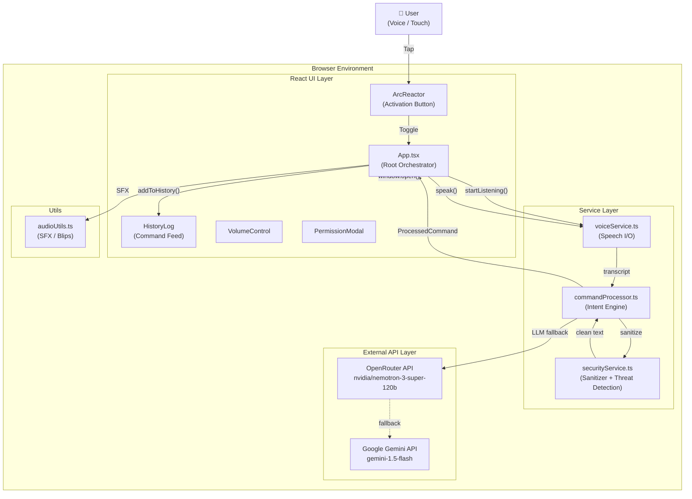
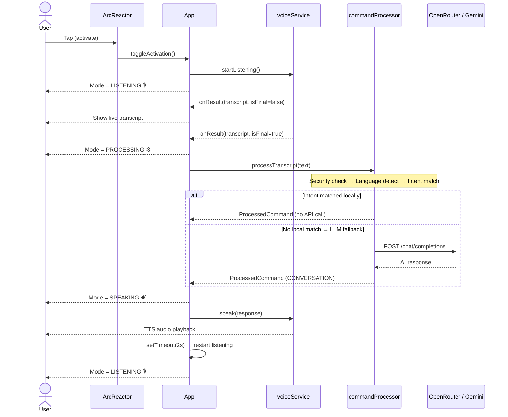
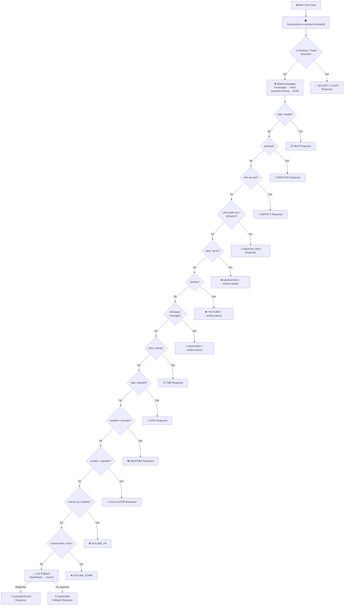
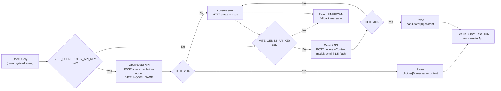
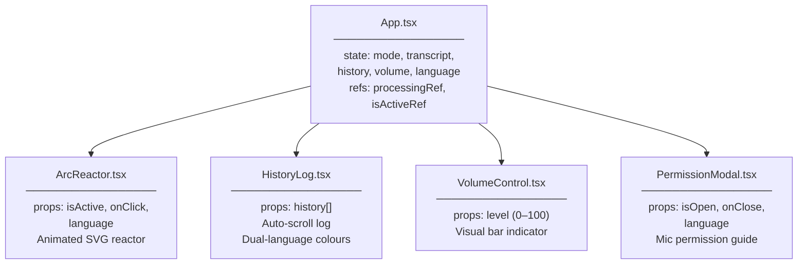
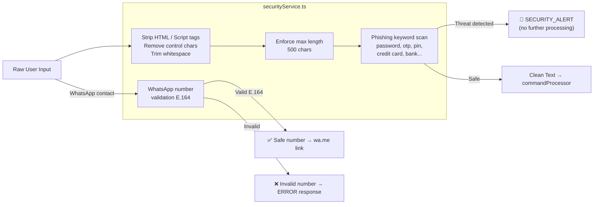

# 🏗️ JARVIS — System Architecture

> **Project:** JARVIS Bilingual AI Assistant  
> **Version:** v3.9.0  
> **Author:** Aryan Ahirwar (VIPHACKER100) — [viphacker100.com](https://viphacker100.com)

---

## 1. High-Level System Overview



---

## 2. Voice Pipeline



---

## 3. Command Processing Flow



---

## 4. LLM Routing & Fallback Logic



---

## 5. React Component Tree



---

## 6. Security Architecture



---

## 7. File Structure

```
jarvis-bilingual-ai-assistant/
│
├── 📄 index.html              # Entry point, Tailwind CDN, Google Fonts, SEO meta
├── 📄 index.tsx               # React root mount
├── 📄 App.tsx                 # Root component — state, mode, voice loop
├── 📄 index.css               # Global styles, custom scrollbar
├── 📄 types.ts                # TypeScript interfaces & enums
├── 📄 constants.ts            # CONTACTS, GREETINGS, INITIAL_VOLUME
│
├── 📁 components/
│   ├── ArcReactor.tsx         # Central activation button (animated SVG)
│   ├── HistoryLog.tsx         # Scrollable interaction history
│   ├── VolumeControl.tsx      # Visual volume level display
│   └── PermissionModal.tsx    # Microphone permission dialog
│
├── 📁 services/
│   ├── commandProcessor.ts    # Intent engine + LLM fallback (main logic)
│   ├── voiceService.ts        # Web Speech API wrapper (STT + TTS)
│   └── securityService.ts     # Input sanitisation + threat detection
│
├── 📁 utils/
│   └── audioUtils.ts          # SFX (blip sounds)
│
├── 📄 .env                    # 🔒 Real keys — gitignored
├── 📄 .env.example            # ✅ Template — committed to repo
├── 📄 .gitignore
├── 📄 LICENSE                 # MIT — © Aryan Ahirwar (VIPHACKER100)
├── 📄 ARCHITECTURE.md         # This file
├── 📄 README.md
├── 📄 package.json
├── 📄 tsconfig.json
└── 📄 vite.config.ts
```

---

## 8. Tech Stack Summary

| Layer | Technology | Purpose |
|---|---|---|
| UI Framework | React 19 | Component-based UI |
| Build Tool | Vite 6.4 | Fast dev server & bundler |
| Styling | Tailwind CSS (CDN) | Utility-first CSS |
| Language | TypeScript 5.8 | Type safety |
| Voice Input | Web Speech API (`webkitSpeechRecognition`) | STT — browser native |
| Voice Output | Web Speech Synthesis API | TTS — browser native |
| Primary AI | OpenRouter → `nvidia/nemotron-3-super-120b-a12b:free` | Conversational LLM |
| Fallback AI | Google Gemini 1.5 Flash | Secondary LLM |
| Font | Rajdhani (Google Fonts) | Tactical HUD typography |
| Security | Custom `SecurityService` | Sanitisation + phishing detection |

---

> *"Architecture is not about what you build — it's about the decisions you make."*  
> **— Aryan Ahirwar (VIPHACKER100)** | [viphacker100.com](https://viphacker100.com)
